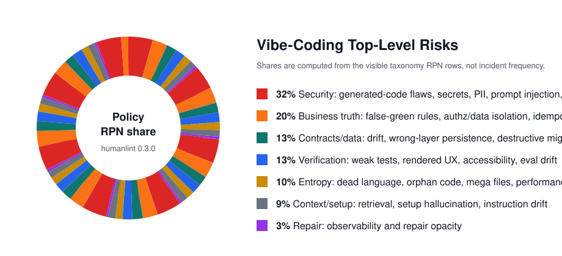

# humanlint


`humanlint` is an open-source standard, paper, and audit CLI for agent-native engineering: repositories built so coding agents can reject wrong code, localize the repair, run the right proof lane, and leave evidence.

Use it in three steps: install the standard, audit now, then ratchet toward conformance. The audit works on any repo; the default target profile is Rust core, TypeScript/React/Vite product surface, PostgreSQL durable truth, generated contracts, and bounded Python for AI/data service work.



## Vibe-Coding Risk Model

`TLR` means Top-Level Risk. These shares are policy-weighted RPN from the paper taxonomy, not incident-frequency measurements.

| TLR | Share | Highest-risk faults | Primary controls |
| --- | ---: | --- | --- |
| Security | 32% | generated insecure code, secrets, PII, prompt injection, excessive agency | security lane, SAST/SCA, secret scans, permission receipts |
| Business truth | 20% | false-green rules, authz/data isolation, idempotency drift | domain invariants, role matrix tests, DB constraints, replay tests |
| Contracts/data | 13% | DTO drift, wrong-layer persistence, destructive migrations | generated clients, generated zones, DB migration proof |
| Verification | 13% | weak tests, pixel/UI, accessibility, eval drift | semantic assertions, Playwright, ARIA/axe, geometry reports |
| Entropy | 10% | dead language, orphan code, mega functions, perf drift | marker scan, owner review, LOC caps, benchmarks |
| Context/setup | 9% | context retrieval, setup hallucination, instruction drift | root router, owner/test maps, one-command setup |
| Repair | 3% | opaque exceptions and missing production evidence | OTel, problem details, repair receipts |

## Quick Start

Install the audit CLI from GitHub:

```bash
cargo install --git https://github.com/jeppsontaylor/humanlint --package humanlint --locked
humanlint audit . --json agent/repo-score.json --md agent/repo-score.md
```

From a checkout:

```bash
git clone https://github.com/jeppsontaylor/humanlint.git
cd humanlint
cargo install --path crates/humanlint --locked
humanlint audit /path/to/repo --json agent/repo-score.json --md agent/repo-score.md
```

Without installing:

```bash
cargo run -p humanlint -- audit /path/to/repo --json agent/repo-score.json --md agent/repo-score.md
```

The Rust audit path is dependency-light. It emits one machine-readable JSON report and one Markdown review surface. The canonical score artifacts now live under `agent/repo-score.json` and `agent/repo-score.md`.

Read the Markdown report first. Fix the highest-priority `agent_fix_queue` item, rerun the audit, and repeat until caps are gone. Scores below `70` usually mean the repo is not agent-operable; `70-84` is advisory/ratchet territory; `85+` is the target floor for standard-mode conformance.

## Streaming Stance

Kafka remains valid brownfield streaming infrastructure when a system needs its durable distributed log, ecosystem, and operational proof. It is not part of the default stack identity. Keep Kafka and any Tansu, Apache Iggy, Fluvio, NATS, Redis Streams, or equivalent client behind generated event contracts and Rust queue adapters. Tansu is the leading Kafka-compatible Rust candidate to evaluate; Iggy and Fluvio are Rust-native greenfield candidates, not Kafka drop-ins.

## Install The Standard

Use `humanlint init` first in a new repo or when backfilling the agent control plane:

```bash
humanlint init --profile rust-ts-vite-react-postgres --ide all --mode advisory --dry-run
humanlint init --profile rust-ts-vite-react-postgres --ide all --mode advisory --yes
humanlint doctor --fail-on high
humanlint audit --changed-from origin/main --mode ratchet
humanlint ci install --github --mode ratchet --min-score 85
```

`init` writes the canonical agent files, `doctor` reports missing controls, and `audit` produces the score contract. The standard files are:

| File | Purpose |
| --- | --- |
| `AGENTS.md` | short root router |
| `agent/HUMANLINT_STANDARD.md` | brief agent bootstrap |
| `agent/owner-map.json` | path ownership map |
| `agent/test-map.json` | path-to-proof routing |
| `agent/generated-zones.toml` | generated output manifest |
| `agent/proof-lanes.toml` | runnable validation lanes |
| `agent/standard-version.toml` | version bindings |

## Add The Agent Standard

For a current repo, run `humanlint init --dry-run` first. It will show what the standard would install before it writes anything.

## CI

GitHub Actions starter:

```yaml
name: humanlint

on:
  pull_request:
  push:
    branches: [main]

jobs:
  audit:
    runs-on: ubuntu-latest
    steps:
      - uses: actions/checkout@v4
      - uses: dtolnay/rust-toolchain@stable
      - run: cargo run -p humanlint -- versions
      - name: Run humanlint
        run: cargo run -p humanlint -- audit . --json agent/repo-score.json --md agent/repo-score.md
      - name: Add score and repair queue to the step summary
        run: |
          {
            echo "### humanlint"
            echo ""
            echo "- score: $(jq -r '.score' agent/repo-score.json)"
            echo "- raw score: $(jq -r '.raw_score' agent/repo-score.json)"
            echo ""
            echo "#### agent_fix_queue"
            jq -r '.agent_fix_queue[] | "- [\(.priority)] \(.path): \(.task) - \(.why)"' agent/repo-score.json
          } >> "$GITHUB_STEP_SUMMARY"
      - uses: actions/upload-artifact@v4
        with:
          name: humanlint-score
          path: |
            agent/repo-score.json
            agent/repo-score.md
```

Teams usually start in advisory mode, then ratchet toward a score floor of `85` and no high-severity findings without an exception.

## Rendered UX QA

Existing open-source tools solve slices of frontend QA: Storybook states, Playwright screenshots, Argos/BackstopJS visual review, axe accessibility scans, Lighthouse/Web Vitals, MSW mocks, and design tokens. Humanlint adds the missing deterministic geometry layer: target size, edge clearance, overlap, clipping, button wrapping, horizontal overflow, sticky obstruction, focus visibility, form labels, nested scrollbars, and z-index token checks.

From this repo:

```bash
npm ci
npx playwright install chromium
npm --workspace @humanlint/ux-qa run build
npm --workspace @humanlint/ux-qa run test
```

Library use in Playwright:

```ts
import { test } from "@playwright/test";
import { expectNoUxViolations } from "@humanlint/ux-qa";

test("dashboard rendered UX", async ({ page }) => {
  await page.goto("http://localhost:3000/dashboard");
  await expectNoUxViolations(page);
});
```

CLI use after building the workspace package:

```bash
node packages/ux-qa/dist/cli.js audit \
  --url http://localhost:3000 \
  --out ux-qa.json \
  --route-id dashboard \
  --artifacts-dir ux-qa-artifacts \
  --screenshot \
  --aria-snapshot \
  --wait-for domcontentloaded \
  --timeout-ms 15000 \
  --viewport 390x844 \
  --viewport 1440x900
```

Through the Rust CLI after building the workspace package:

```bash
humanlint ux audit --config agent/ux-qa.toml --out target/humanlint/ux-qa.json
humanlint ux storybook --url http://localhost:6006 --config agent/ux-qa.toml
```

The CLI expects a running app or preview URL. It defaults to `domcontentloaded`; use `--wait-for` and `--timeout-ms` to tune readiness for slower previews or local dev servers. Reports include rule IDs, selectors, viewport data, severity, merge decision, and artifact paths for screenshots, crops, and ARIA snapshots when requested. Deterministic geometry failures should block; visual baseline diffs should route to owner approval; AI/VLM visual opinions should stay review-only unless backed by deterministic evidence.

## Repository Map

- `crates/humanlint/` - installable Rust audit package
- `packages/ux-qa/` - optional Playwright rendered-UX geometry runtime
- `agent/` - standard version, owner/test maps, generated zones, proof lanes, repo score
- `docs/` - standard, rubric, testing doctrine, architecture, release plan
- `paper/` - IEEE-style paper source and generated PDF
- `tips/` - source notes feeding the paper and standard
- `reference/` - read-only source material

## Paper Naming

Current paper artifacts are intentionally named after the project:

- `paper/humanlint.tex` - canonical TeX entrypoint
- `paper/humanlint.pdf` - generated render
- `paper/humanlint.md` - agent-readable companion
- `paper/tex/` - included TeX source sections

Do not add `main.md`, `main.tex`, or `main.pdf` anywhere in this repo. `just versions` enforces this so every paper artifact stays project-titled.
Do not add root `repo-score.json` or `repo-score.md`; the canonical audit outputs are `agent/repo-score.json` and `agent/repo-score.md`.

## Development

```bash
just versions
just fast
just ux-qa
just paper
just check
```

Do not hand-edit generated artifacts such as `paper/humanlint.pdf` or `package-lock.json`; change the source and regenerate.
