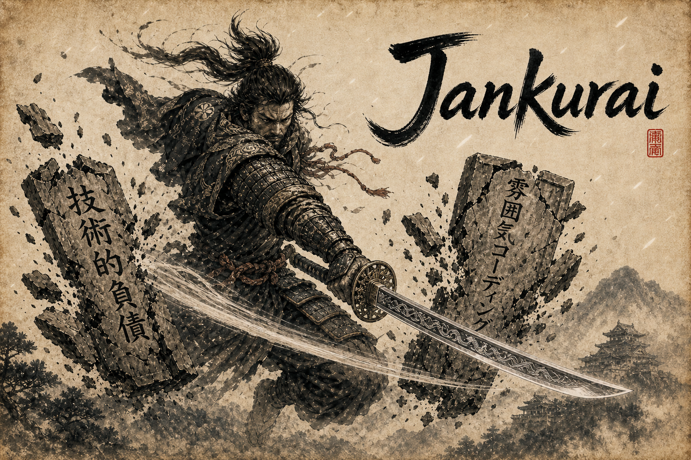

<p align="center">
  
</p>

# Jankurai

[](https://github.com/jeppsontaylor/Jankurai/actions/workflows/jankurai.yml)
[](LICENSE)

Jankurai is a trustworthy-merge standard and local audit CLI for teams that want every human or AI-authored change to arrive with proof. Its public rule is simple: no proof, no merge; no receipt, no trust.

- Turns ownership maps, proof lanes, generated zones, security boundaries, rolling scores, merge witnesses, and repair queues into files agents and humans can both read.
- Starts with read-only reports, then lets teams adopt guidance, CI, hooks, and ratchets only when they choose.
- Leaves receipts: JSON/Markdown reports, score history, proof artifacts, and command evidence under predictable paths.

Jankurai is not a model, hosted AI service, or "open source AI" system. It is repository infrastructure for governing how agents work with code.

## Install

Prerequisites: `git` and a Rust toolchain with `cargo` on `PATH`.

```bash
git clone https://github.com/jeppsontaylor/Jankurai.git
cd Jankurai
cargo install --path crates/jankurai --locked
jankurai --version
```

For demos or CI logs, force rich terminal output:

```bash
export JANKURAI_COLOR=always
export JANKURAI_PROGRESS=always
```

## Try Safely In 5 Minutes

Run the first pass from the repository you want to inspect. These commands read source files and write only the report paths you name under `target/jankurai/`.

```bash
mkdir -p target/jankurai

jankurai adopt . \
  --profile auto \
  --mode observe \
  --out target/jankurai/adoption-plan.json \
  --md target/jankurai/adoption-plan.md

jankurai audit . \
  --mode advisory \
  --json target/jankurai/repo-score.json \
  --md target/jankurai/repo-score.md
```

Expected artifacts:

| Artifact | Purpose |
| --- | --- |
| `target/jankurai/adoption-plan.md` | Recommended next steps and adoption level. |
| `target/jankurai/repo-score.md` | Advisory score, findings, hard caps, and repair queue. |
| `target/jankurai/score-history.jsonl` | One score-history row per audit run. |

## Adopt Levels

| Level | Command | Writes | Use When |
| --- | --- | --- | --- |
| Observe | `jankurai adopt . --mode observe` | Named report files only. | You want an inventory before Jankurai changes tracked files. |
| Agents | `jankurai init . --level agents --dry-run` | Agent guidance after you apply with `--yes`. | You want Codex, Claude, Cursor, Copilot, or another agent to follow the same local rules. |
| Full | `jankurai init . --level full --dry-run` | Full scaffold after review and `--yes`. | You want owner maps, proof lanes, generated-zone policy, docs, contracts/db placeholders, CI, and hooks. |
| Ratchet | `jankurai ci install . --github --mode ratchet --baseline <file>` | CI gate. | The team has accepted a baseline and wants to block regression. |

Ratchet mode is impossible without an accepted baseline. Start in observe or advisory mode, commit `agent/repo-score.json` as the baseline when the team accepts it, then install ratchet CI with `--baseline`.

## Daily Loop

```bash
jankurai context-pack . --changed <path> --max-tokens 6000 --out target/jankurai/context-pack.json --md target/jankurai/context-pack.md
jankurai prove . --changed <path> --plan-out target/jankurai/proof-plan.json --plan-md target/jankurai/proof-plan.md
jankurai audit . --mode advisory --json target/jankurai/repo-score.json --md target/jankurai/repo-score.md
jankurai witness . --changed-from origin/main --baseline agent/repo-score.json --out target/jankurai/merge-witness.json --md target/jankurai/merge-witness.md
```

Preview before tracked writes:

```bash
jankurai init . \
  --profile rust-ts-postgres \
  --level agents \
  --dry-run \
  --plan-json target/jankurai/init-agents.json
```

Apply only after reviewing the plan:

```bash
jankurai init . --profile rust-ts-postgres --level agents --yes
jankurai adapters verify .
```

Then open your coding agent from the same repo root and ask it to:

```text
Read AGENTS.md, follow the jankurai standard, then run the proof lane for my change.
```

## Update An Initialized Repo

Check what would change:

```bash
jankurai update . \
  --check \
  --out target/jankurai/update/update-plan.json \
  --md target/jankurai/update/update-plan.md
```

Apply reviewed updates and allow the CLI to update itself when needed:

```bash
jankurai update . --self --apply --yes
```

Use `--offline` when the update must avoid network-backed version checks.

## How Jankurai Handles AI-Agent Risk

Jankurai treats agent behavior as repository policy, not chat convention.

| Risk | Jankurai Control |
| --- | --- |
| Broad or surprising writes | `agent/owner-map.json`, generated-zone manifests, dry-run plans, and explicit apply flags. |
| Weak proof | `agent/test-map.json`, proof lanes, `jankurai lane`, `jankurai prove`, and receipt paths under `target/jankurai/`. |
| Prompt injection | Root `AGENTS.md`, thin provider adapters, and rules that keep untrusted context from changing trusted policy or tool permissions. |
| Generated drift | `agent/generated-zones.toml` identifies generated/read-only outputs and the source command that owns them. |
| Security regressions | Security policy artifacts, `jankurai security run`, dependency/secret checks, and private reporting guidance. |
| Lost context | JSON/Markdown reports, score history, repair queues, and final handoff receipts. |

The project does not send repository contents to a hosted Jankurai service. The CLI inspects local files and writes local artifacts. Any external tools you run through your coding agent remain governed by that agent and your environment.

## Control-Plane Surfaces

Jankurai works as a local control plane over a few repeatable surfaces:

| Surface | Commands |
| --- | --- |
| Adoption and drift | `adopt`, `init`, `update`, `doctor` |
| Bounded agent context | `context-pack`, `adapters verify`, `adapters sync`, `agent verify`, `hooks install` |
| Proof and evidence | `lane`, `proof`, `prove`, `proof-verify` |
| Audit and routing | `audit`, `witness`, `score diff`, `score trend`, `rules verify`, `issues export`, score history, repair queues |
| Security and UX evidence | `security run`, `ux ...` |
| Repair and expiry | `repair-plan`, `repair`, `optimize`, `exceptions expire` |
| Reusable/public evidence | `registry`, `cell`, `bench`, `certify`, `govern`, `publish` |

The loop is intentionally ordinary: changed paths map to owners and proof lanes, commands leave receipts, audit turns evidence into findings, and repair plans keep follow-up bounded.

## Project Status

Jankurai is early but usable as a local Rust CLI and standard workspace. The current source tree includes audit, init, update, proof, repair planning, migration analysis, security evidence, UX QA, publication evidence, and the paper source for *Humans Were the Bug: From Vibe Coding to Agent-Native Engineering*.

Compatibility posture:

- Public report schemas should remain compatible or receive explicit migration notes.
- Ratchet enforcement should be opt-in and baseline-backed.
- New agent-facing guidance should be deterministic, local, and reviewable.

## Docs

- [Install guide](docs/install.md)
- [Adoption guide](docs/adoption.md)
- [Agent-native standard](docs/agent-native-standard.md)
- [Architecture](docs/architecture.md)
- [Testing and proof lanes](docs/testing.md)
- [Merge witness](docs/merge-witness.md)
- [Rolling score](docs/rolling-score.md)
- [Security tool matrix](docs/security-tool-matrix.md)
- [Mission](docs/mission.md)

## Contributing

Read [CONTRIBUTING.md](CONTRIBUTING.md) before opening a pull request. The short version:

```bash
cargo fmt --all
cargo test -p jankurai
just fast
just score
git diff --check
```

Keep `reference/` read-only, do not hand-edit generated artifacts, and route changed paths through `agent/owner-map.json` and `agent/test-map.json`.

## Security

Do not open public issues for suspected vulnerabilities. Use GitHub private vulnerability reporting for this repository:

https://github.com/jeppsontaylor/Jankurai/security/advisories/new

See [SECURITY.md](SECURITY.md) for supported versions, evidence lanes, and advisory handling.

## Support

Use [GitHub issues](https://github.com/jeppsontaylor/Jankurai/issues) for reproducible bugs, documentation gaps, and feature proposals. See [SUPPORT.md](SUPPORT.md) for what to include.

## License

Jankurai is licensed under the [MIT License](LICENSE).

## Citation And Paper

This repository is the working source for the paper *Humans Were the Bug: From Vibe Coding to Agent-Native Engineering*.

- Paper source: [paper/jankurai.tex](paper/jankurai.tex)
- Agent-readable companion: [paper/jankurai.md](paper/jankurai.md)
- Mission: [docs/mission.md](docs/mission.md)
